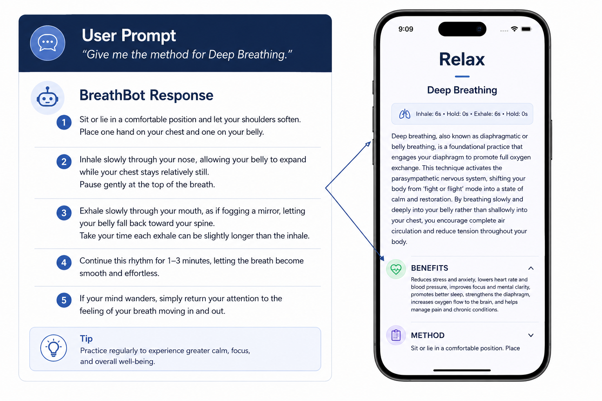
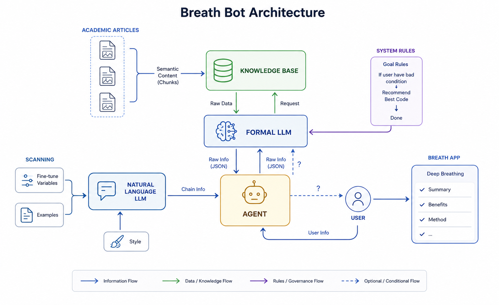
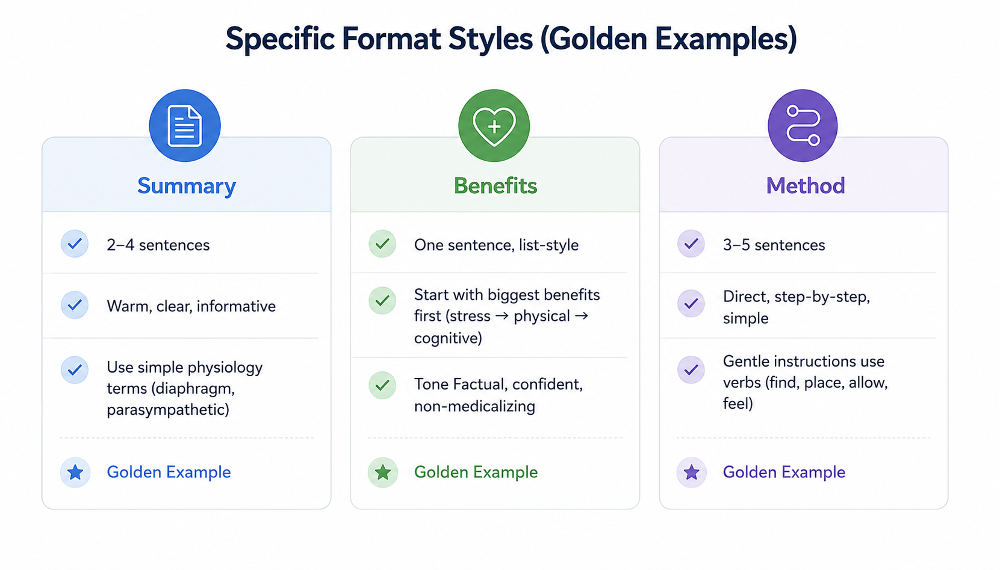
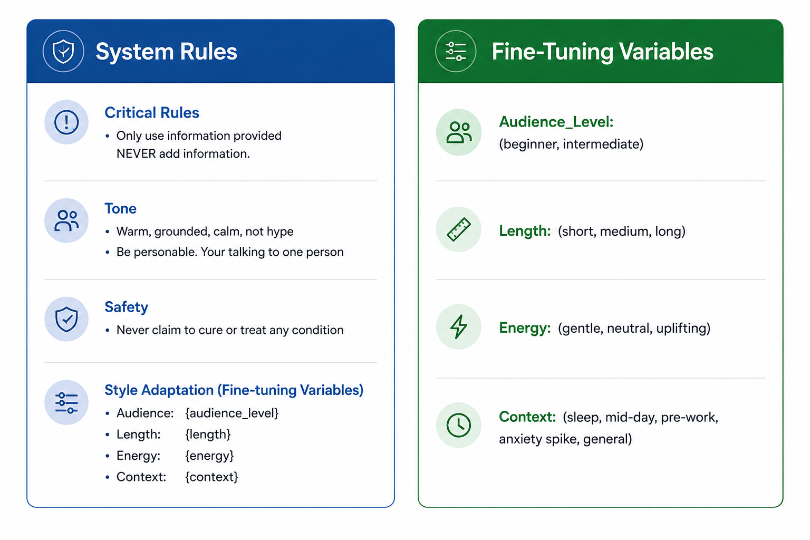

# Breath-Bot

**Generate research-backed breathing content with a consistent brand voice.**

Built for my mindfulness app, **JustBreatheBro** — Breath-AI turns peer-reviewed research into app-ready breathing exercises while maintaining a calm, approachable tone.

- **App Store:** [Download JustBreatheBro](https://apps.apple.com/us/app/justbreathebro/id6756590863)
- **GitHub:** [github.com/michael-d-abraham/JustBreatheBro](https://github.com/michael-d-abraham/JustBreatheBro)

---

## Why I built this

I needed a way to generate breathing exercise content that was both scientifically accurate and consistent with the calm, approachable voice of the app.

Breath-AI solves this by generating content exclusively from a curated library of peer-reviewed research while using a separate style retrieval system to maintain a consistent brand voice. Strict guardrails prevent the system from relying on internet searches or unsupported information, ensuring responses remain grounded, accurate, and on-brand.

---

## Highlights

- **Built a complete RAG system from scratch**
- **Created a dual-retrieval architecture** (content + style)
- **Implemented hallucination guardrails**
- **Designed a production content-generation workflow**
- **Built something used by a real mobile app**

---

## What it does

- Generate **descriptions**, **step-by-step methods**, **benefits**, and **short summaries**
- Keep a **consistent brand voice** across every exercise
- **Adapt tone** for sleep, anxiety, pre-work, mid-day reset, and more
- Trust the output — facts come from **your PDFs**, not the model's imagination
- Say **"I don't know"** when the research library has no answer — never guess

---

## How it works

### From question to app content

Ask a question in plain English. Breath-AI returns structured content ready to drop into a mobile app screen.



*Example: "Give me the method for Deep Breathing" produces step-by-step instructions, tips, and app-ready sections (Summary, Benefits, Method).*

---

### Two brains, one answer

One agent finds the facts from research papers. A second agent rewrites them in the app's voice. If nothing relevant is found, the system stops — it won't make something up.



| Step | What happens |
|------|--------------|
| **1. Research lookup** | Searches peer-reviewed PDFs for relevant breathing information |
| **2. Fact check** | If nothing is found, returns "I don't know" |
| **3. Style pass** | Retrieves brand voice examples and rewrites in a calm, approachable tone |
| **4. App-ready output** | Summary · Benefits · Method — ready for JustBreatheBro |

---

### Every response follows a format

All generated content matches three golden example formats — so every exercise feels consistent across the app.



| Section | What it looks like |
|---------|-------------------|
| **Summary** | 2–4 warm sentences explaining the exercise in plain language |
| **Benefits** | A concise list — stress relief first, then physical, then mental |
| **Method** | 3–5 gentle step-by-step instructions using simple active verbs |

---

### Adapt the tone to the moment

The same breathing exercise can sound different depending on when someone needs it — bedtime vs. pre-work vs. an anxiety moment — without losing the app's voice.



| Dimension | What it controls |
|-----------|-----------------|
| **Audience** | Beginner-friendly vs. more detailed for experienced users |
| **Length** | Short summary vs. full explanation |
| **Energy** | Very gentle and soft vs. slightly more uplifting |
| **Context** | Framed for sleep, mid-day reset, pre-work, anxiety, or general use |

Hard rules always apply: only use retrieved facts, warm tone, no medical claims.

---

### Where the knowledge comes from

**Research papers** — 7 peer-reviewed PDFs on breathing techniques (diaphragmatic breathing, pain management, psychology research, and more). This is the only source of facts.

**Style guides** — 4 example files that teach the system how JustBreatheBro should sound: short descriptions, full descriptions, benefits, and methods. Update the voice by adding new examples — no code changes needed.

---

## Get started

```bash
pip install -r requirements.txt
```

Create `.env`:

```
GEMINI_API_KEY=your_key_here
```

Build the knowledge base (once):

```bash
python ingest_exercises.py   # PDFs → papers/
python ingest_style.py       # voice examples → style/
```

Run:

```bash
python run.py "How do I do 4-7-8 breathing?"
python run.py --chat
python run.py "Describe box breathing" --context sleep --energy very_gentle
```

### Tone control flags

| Flag | Options |
|------|---------|
| `--audience-level` | `beginner` · `intermediate` |
| `--length` | `short` · `medium` · `long` |
| `--energy` | `very_gentle` · `neutral` · `slightly_uplifting` |
| `--context` | `sleep` · `mid-day_reset` · `pre-work` · `anxiety_spike` · `general` |

---

## Technical reference

### What was built

| Layer | Files | Purpose |
|-------|-------|---------|
| **CLI** | `run.py` | Entry point — single query or `--chat` mode |
| **Agents** | `agent.py` | Two-LLM pipeline, early-return guardrails, tone params |
| **Models** | `model_utils.py` | Gemini via OpenAI-compatible API |
| **Ingestion** | `ingest_exercises.py`, `ingest_style.py` | PDF + style → ChromaDB |
| **Extraction** | `scraper.py` | PDF text extraction, URL/PDF fetching support |
| **Retrieval** | `tools/vector_store.py` | ChromaDB retrievers (content + style) |
| **Tools** | `tools/retrieval_tool.py` | smolagents tools for document + style search |
| **Report** | `REPORT.html` | Full system write-up (architecture, evaluation, PEAS) |

### Data pipeline

**Content corpus** — `papers/` → ChromaDB collection `breathing_exercises`  
PDF → PyPDF extraction → 500-char chunks (100 overlap) → local embeddings → vector store

**Style corpus** — `style/` → ChromaDB collection `breath_style_guides`

| File | Content type |
|------|--------------|
| `shortDescription.txt` | 6–12 word summaries |
| `description.txt` | 2–4 sentence explanations |
| `benefit.txt` | Benefit lists |
| `method.txt` | Step-by-step instructions |

### Architecture

**Key design choices:**
- **Dual RAG** — content (`breathing_exercises`) and style (`breath_style_guides`) in separate collections
- **Source grounding** — language model only sees formatted retrieval output, not raw PDFs
- **Early return** — `NO_RELEVANT_INFORMATION` sentinel stops the pipeline before styling
- **Local embeddings** — `sentence-transformers/all-MiniLM-L6-v2`, zero embedding API cost

### Agent pipeline

| Step | Agent | Tool | Output |
|------|-------|------|--------|
| 1 | Retrieval Agent | `retrieve_documents` | Structured facts from PDFs (top-k=4) |
| 2 | Guard check | — | Stop if no relevant content found |
| 3 | Language Agent | `retrieve_style` | On-brand copy using style examples (top-k=4) |

**Safety built in:**
- Facts must come from ingested PDFs only
- Hedged wellness language ("may help", "can support")
- No medical claims or invented techniques
- Explicit uncertainty when knowledge base has no match

### Tech stack

| Category | Technology | Role |
|----------|------------|------|
| **Language** | Python 3 | Core runtime |
| **Agent framework** | [smolagents](https://github.com/huggingface/smolagents) | Tool-calling agents (`ToolCallingAgent`) |
| **LLM** | Google Gemini 2.5 Flash Lite | Retrieval + language agents (OpenAI-compatible API) |
| **Vector DB** | ChromaDB | Persistent storage — two collections |
| **Embeddings** | `sentence-transformers/all-MiniLM-L6-v2` | Local semantic search (no API cost) |
| **Chunking** | LangChain `RecursiveCharacterTextSplitter` | 500 chars, 100 overlap |
| **PDF parsing** | PyPDF | Text extraction from research papers |
| **Web scraping** | BeautifulSoup4 + Requests | Optional URL/PDF fetching (`scraper.py`) |
| **Config** | python-dotenv | API key management via `.env` |
| **Interface** | argparse CLI | Single query + interactive chat |

```
smolagents · chromadb · sentence-transformers · langchain-text-splitters
python-dotenv · beautifulsoup4 · requests · pypdf
```

### Project evolution

| Phase | Focus |
|-------|-------|
| **Week 1–2** | Single LLM + system prompts for style control |
| **Week 3** | Style RAG corpus, dual retrieval, tone parameters |
| **Week 4** | Two-LLM architecture — retrieval vs. language separation |

### Key concepts demonstrated

- Retrieval-Augmented Generation (RAG)
- Multi-agent orchestration
- Source-grounded content generation
- Vector search with ChromaDB
- Tool-calling agents
- Prompt and context engineering
- PDF ingestion and embedding pipelines

### Documentation

| Resource | Description |
|----------|-------------|
| [`REPORT.html`](REPORT.html) | Full technical report — architecture, PEAS framework, evaluation |

---

*Built for real content workflows — accurate, controllable, and maintainable.*
